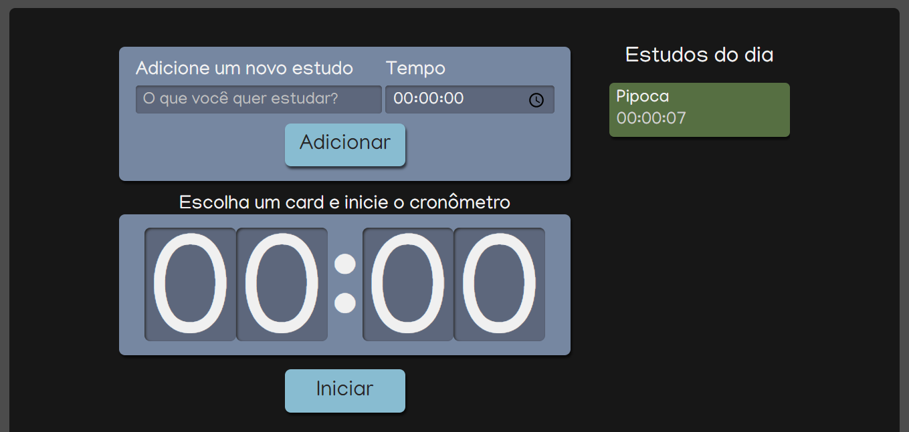

 
 

 
 <h1 align="left">Projeto -> React com Typescript</h1>
 <h2 align="left">Feito por : Thiago Zambelli</h2>
 
  

&nbsp;

---

&nbsp;

# Problemas e soluções -

---

&nbsp;

&nbsp;

&nbsp;

## UUid

> Pacote de extenção do NPM para gerar IDs 
- O comando para instalação é `npm i uuid`

>A importação do pacote foi feita com o `import {v4 as uuidv4} from 'uuid'`, porem o typescrip pediu para crir uma interface de tipo para ele, isso foi feito com o comando `npm i --save-dev @types/uuid` fornecido pelo proprio typescript

&nbsp;

&nbsp;

&nbsp;

## Selecionando Itens

> Para o funcionamento da aplicação era necessario que os itens da lista fossem selecionaveis. Por tanto, foi criado uma variavel para eles com o nome de `selecionado = false`, gerando um booleano com o valor falso. Para que fosse usado o `useState` para diferenciar itens selecionados fiemos assim:

~~~TypeScript
function selecionaTarefa(tarefaSelecionada: ITarefa){
    setSelecionado(tarefaSelecionada);
    setTarefas(antigas => antigas.map(tarefa => ({
      ...tarefa,
      selecionado: tarefa.id === tarefaSelecionada.id ? true : false
    })))
  }
~~~
  > Uma função `selecionarTarefa` que pega o item selecionado, faz um map na lista de itens comparando os Ids e em seguida troca a variavel `selecionado` de `false` pra `true` em todos que forem os mesmos IDs e o inverso também.

> Em seguida no `Item` e colocado uma ternaria para a condição `selecionado`, dando um estilo css diferente para os que tiverem o valor como `true`

 - `className={`${style.item} ${selecionado ? style.itemSelecionado : ""}`}`
 
&nbsp;

&nbsp;

&nbsp;

## Criação do projeto com TypeScript

> Comando `npx create-react-app --template typescript react-typescript --use-npm` onde
- npx (Comando para rodar)
- create-react-app (Comando para criar um app React)
- --template typescript (diz para o create que sera usado typescript)
- react-typescript (nome da aplicação criada)

&nbsp;

&nbsp;

&nbsp;
## Problema de modulação do CSS

>Não sei se é por causa da defasagem de tempo da aula mas algumas coisas estao bem diferentes entre o que foi aprendido em ccursoso anteriors e neste. Principalmente com relação ao CSS module.

&nbsp;

&nbsp;

&nbsp;

## Utilização de ternario para estilos:

>Podemos usar um ternario para a alocação de estilos no JS (Consequentemente React)

~~~JavaScript
const objOn = true;
const style = {
  backgroundColor: objOn ? "green" : "red"
}

<button style={style}>
</button>

~~~

&nbsp;

&nbsp;

&nbsp;

## Desestruturação das props ao serem enviadas:

>Ao mandar um Obj como prop de um componente, podemos mandar prop a pro (utilizado principalmente quando queremos mandar uma parte delas), ou podemos mandar o Obj em forma de spred

  - Forma 1:

    ~~~JavaScript
    <Componente 
      prop1={obj.elemento1}
      prop2={obj.elemento2}
      prop3={obj.elemento3}
      prop4={obj.elemento4}
    />    
    ~~~

  - Forma 2:

    ~~~JavaScript
    <Componente 
      {...obj}
    />

    ~~~

&nbsp;

&nbsp;

&nbsp;

## useEffect():

> Hook padrão do react que a função de alterar componentes quando alguma coisa muda.
> O primeiro parametro é a função que vais ser executada, e o segundo é o que deve ser ecutado para ver a mudança.

~~~JavaScript
useEffect(() => {

    },[selecionado])

~~~

&nbsp;

&nbsp;

&nbsp;

## Ciclo de vida dos componentes:

- `componentWillMount` (antes de ser montado)
- `componentDidMount` (acabou de ser montado)
- `componentWillUpdate` (componente acabou de atualizar)
- `componentWillUnmount` (componente vai ser desmontado)

&nbsp;

&nbsp;

&nbsp;

# Aulas - 

---

&nbsp;

### Aula 1:

- Configurar o seu ambiente para rodar o projeto;
  - Aprendemos como configurar o seu ambiente para poder criar e rodar um projeto React, instalando o Node/npm e o GIT para controlarmos as versões e/ou baixarmos a aplicação do Github.
- Diferenciar npx de npm;
  - Utilizamos o npx na aplicação e aprendemos a diferenciar o comando npx do comando npm, mostrando quando é melhor usar cada um.
- Criar um projeto com create-react-app com template typescript usando npm;
  - Criamos um projeto utilizando npx, entendemos que o CRA (Create React App) tem possibilidade de criar projetos com template (optamos pelo typescript), escolhendo o npm como o nosso gerenciador de pacotes padrão.
- O Create React App estrutura o projeto.
  - Entendemos como o Create React App estrutura a aplicação, vendo dos arquivos de configuração (tsconfig, package.json, package-lock.json entre outros), até as pastas/arquivos que serão atualizados por nós (pasta src, arquivos app.tsx, index.tsx, index.css entre outros).

&nbsp;

### Aula 2:

- Funciona a pasta public;
  - Abordamos sobre a pasta public, para que ela serve e por que raramente mexemos nela, mostramos também o arquivo index.html e como que o React popula ele com os componentes.
- Criar um componente com class component e como utilizá-lo;
  - Criamos um componente com class component, mostrando toda a sintaxe desde o extends até o retorno e o export.
- O que é JSX;
  - Vimos que o React retorna na verdade um JSX, não um HTML, também falamos de algumas diferenças entre os dois.
- Criar um function component;
  - Também criamos um componente com function component (a forma mais atual de se escrever componentes desde a versão 16.8), e mostramos como é mais simples criarmos dessa forma.
- Utilizar o método map para renderizar arrays.
  - Renderizamos arrays de JSX com o método map, mostrando que assim conseguimos aproveitar parte do JSX e mudar apenas o valor de item para item, utilizando assim o princípio DRY (Don't Repeat Yourself).

&nbsp;

### Aula 3:
- Usar o CSS inline;
  - Aprendemos como criar o CSS inline direto no atributo, como variável JS e utilizando condicionais para mudar o estilo.
- Utilizar CSS e Sass no projeto;
  - Vimos como importar CSS e SASS no projeto é fácil dentro de um projeto criado com Create React App.
- Colocar o CSS Modules em um projeto com Create React App + Typescript;
  - Configuramos o projeto para aceitar CSS Modules.
Vantagens de se utilizar CSS Modules.
- Discutimos as vantagens de se utilizar CSS Modules na aplicação.

&nbsp;

### Aula 4:

- Adicionar informações externas ao componente com Props;
  - Aprendemos a utilizar propriedades externas para reutilizar componentes de forma única.
- Funciona o props.children;
  - Vimos que o React disponibiliza uma props padrão chamada children, que ao contrário das outras props, é escrita dentro do componente, abrindo e fechando a tag como em uma tag HTML.
- O key (chaves) é importante em arrays no React;
  - Entendemos mais a fundo como o React trabalha com arrays, e como o key é importante para que ele não se perca entre os itens deste array.
- Usar spread operator de forma consciente para passar props para os componentes;
  - Utilizamos o spread operator para poder passar todos os itens de um objeto como props para o componente, também pensamos como isso pode se tornar um problema.

&nbsp;

### Aula 5:

- O React utiliza os estados para atualizar os componentes;
  - Aprendemos como o React guarda informações que serão importantes para uma possível nova renderização de um componente.
- Criar estados com function components e class components;
  - Criamos estados tanto com function components quanto com class components, entendendo como se cria esses estados em cada tipo.
- Controlar campos de um Formulário com estados;
  - Aprendemos a diferença de um formulário/input controlado e não controlado, e como podemos controlá-los para pegar/mudar seus campos como quisermos.
- Criar interfaces e reutilizá-las;
  - Vimos como o Typescript nos dá uma forma de criar interfaces para podermos descrever tipos mais complexos, como os props dos componentes.
- Utilizar props e para informar uma mudança de estado;
  - Utilizamos a junção de props + state para podermos passar state para outros componentes e para podermos avisar que um estado deve ser mudado.

### Aula 6:

- Compartilhar valores comuns entre componentes;
  - Aprendemos como criar um estado que será compartilhado entre vários componentes.
- Extender interfaces;
  - Usamos a facilidade de estender uma interface dentro de outra interface para reaproveitar código.
- Adicionar classes CSS de forma condicional;
  - Aprendemos a utilizar um ternário para mudar classes CSS de uma tag baseada em alguma prop com template string.
- Criar pastas utilitárias;
  - Debatemos sobre formas de criar pastas com funções utilitárias compartilhadas na aplicação.

### Aula 7:

- Funciona o ciclo de vida de um componente;
  - Entendemos como o ciclo de vida de um componente funciona, desde o seu nascimento até a sua morte.
- Utilizar o useEffect;
  - Utilizamos o useEffect para resolver um problema que tivemos e vimos como esse hook é importante no ecossistema React.
- Desestruturar strings;
  - Aprendemos que podemos desestruturar strings e que podemos colocar a opção downLevelIteration para que possamos fazer essa desestruturação.
- Utilizar função recursiva;
  - Criamos uma função recursiva para resolver o problema da contagem regressiva.
- Refatorar um class component para um function component;
  - Aprendemos como refatorar um class component para function component.